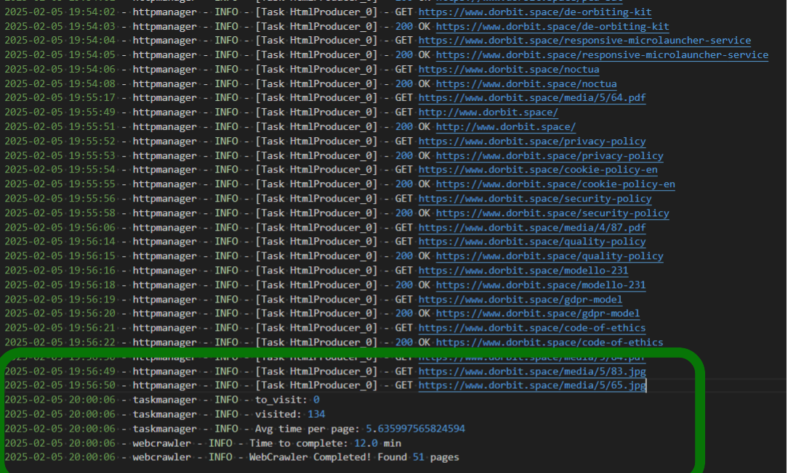

# WebCrawler
WebCrawler is a web scraper looking for all web pages belonging to same domain strarting from a specific url.
For each web page, the crawler will collect all referenced link creating own index tree. At the end of 
crawling process, the tree will be displayed at console. All visited pages will be highlighted with uppercase.

# Requirements:

* [Python](https://www.python.org/): >=3.13
* [Pydantic](https://docs.pydantic.dev/latest/)
* [aiohttp](https://docs.aiohttp.org/en/stable/)
* [selectolax](https://selectolax.readthedocs.io/en/latest/parser.html)
* [Poetry](https://python-poetry.org/): >=2.0

# How to run
In order to run this project, please follow these instructions:

1. Clone project into your local folder
2. Install python and poetry as described into documentation 
3. Open a terminal and run the following commands:

    a. `poetry install`

    b. `poetry run python webcrawler\webcraler.py <http_url|https_url>`

 
# Solution
The idea of the web crawler is based on producer/consumer pattern in order to generate multiple tasks according to available resources.
The Producer will download the pages from internet and provide them to the consumer which will analyze them and extract the links for each page. 
The communication between producer and consumer is performed throught two **Queues** one to keep tracks of the urls to visit and one to keep track of the downloaded pages.
This solution allow to scale accordingly to resources of the machine where you are going to run the script, since the amount of producers and consumers is configurable.

Below there is an image with performance of the web crawler visiting [D-Orbit](https://www.dorbit.space/) website

# Limits and Future Improvements
The proposal solution has got the following limits:

* Crawler is able to detect only HTTP/HTTPS URLS, for instance mailto links will be discarded.
* Crawler is not able to detect that *www.dorbit.space* and *dorbit.space* are the same web page.  
* Crawler extracts links only from anchor elements `<a>`
* Crawler provides an helper function called `visit_pages` which allow to run a function on each link present in the page: currently only print to console is supported. 
* Crawler requires to make choices according to your resources: the solution provides multiple tasks to process pages but it requires to store the whole html pages in memory until they are fully processed.
* Crawler does NOT support configuration from config file for the amount of consumers and producers to run

Although, the crawler provides the possibility to run multiple consumers and producers at same time, the solution has been tested only with default configuration (**1 Producer and 1 Consumer**). 

Possible improvements are consequences of the limits described above:

* Test scalability with different configurations of producer/consumer and amount of HTML pages stored at same time
* Avoid to download and parse twice the web page retrieved by 'WWW' and 'non-WWW' URLs
* Incapsulate the webcrawler inside a Docker container